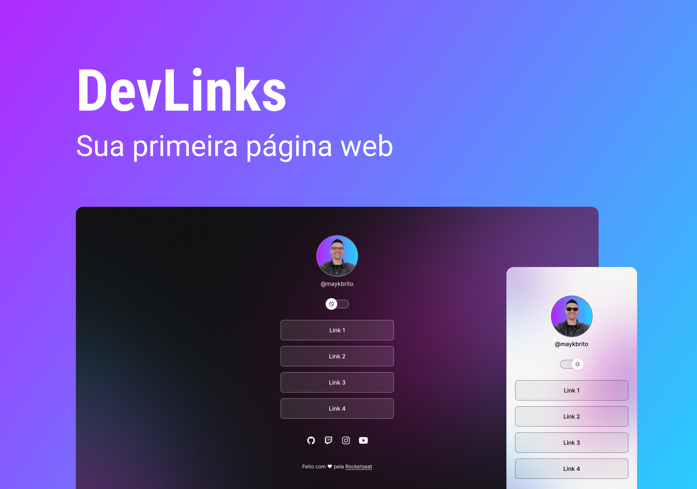

<h1 align="center"> DevLinks </h1>

 
  Programa exclusivo e gratuito, promovido pela <a href="https://www.rocketseat.com.br/">Rocketseat</a> para ensino de tecnologia WEB.

  <a href="#-tecnologias">Tecnologias</a>&nbsp;&nbsp;&nbsp;|&nbsp;&nbsp;&nbsp;
  <a href="#-projeto">Projeto</a>&nbsp;&nbsp;&nbsp;|&nbsp;&nbsp;&nbsp;
  <a href="#-layout">Layout</a>&nbsp;&nbsp;&nbsp;|&nbsp;&nbsp;&nbsp;
  <a href="#memo-licença">Licença</a>

  

 

  

## 🚀 Tecnologias

Esse projeto foi desenvolvido com as seguintes tecnologias:

- HTML e CSS
- JavaScript
- Git e Github

## 💻 Projeto

O DevLinks é um agregador de links para usar como cartão de visita online.

## 🔖 Layout

Você pode visualizar o layout do projeto através [desse link](https://efficient-sloth-d85.notion.site/DevLinks-d7841615addc4269ba5c5bba12a6edbe). É necessário ter conta no [Figma](https://www.figma.com/community/file/1187422022288947321/DevLinks) para acessá-lo.

## :memo: Licença

Esse projeto está sob a licença MIT. Veja o arquivo [LICENSE](LICENSE.md) para mais detalhes.

___

Feito com ♥ by [Rocketseat](https://rocketseat.com.br) :wave: [Participe da nossa comunidade!](https://discordapp.com/invite/gCRAFhc)

[⬆ Voltar ao topo](#devlinks) 